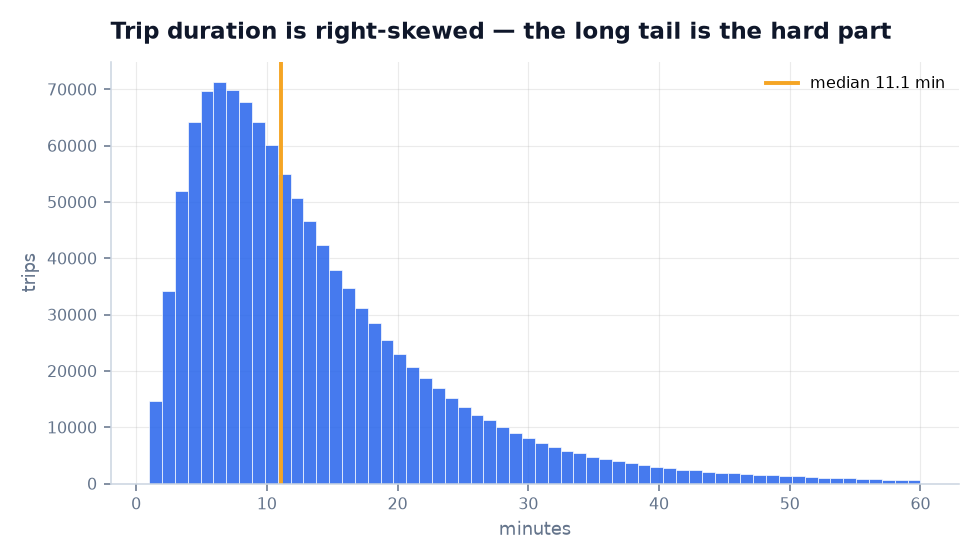
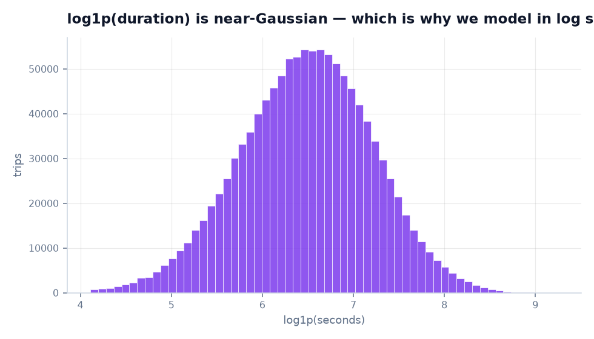
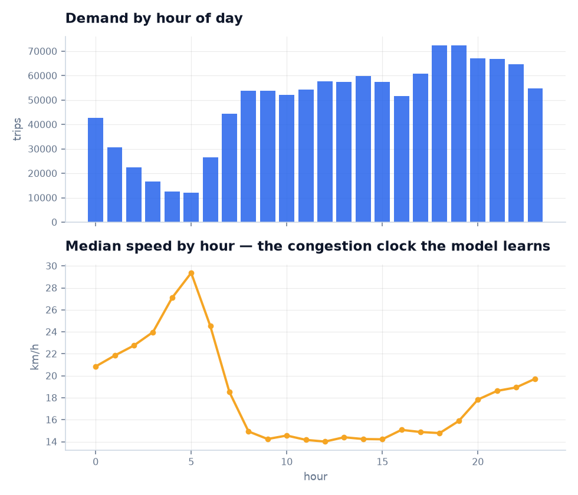
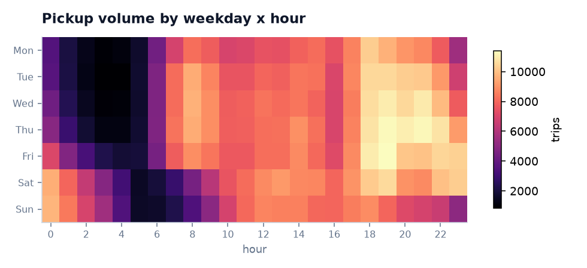
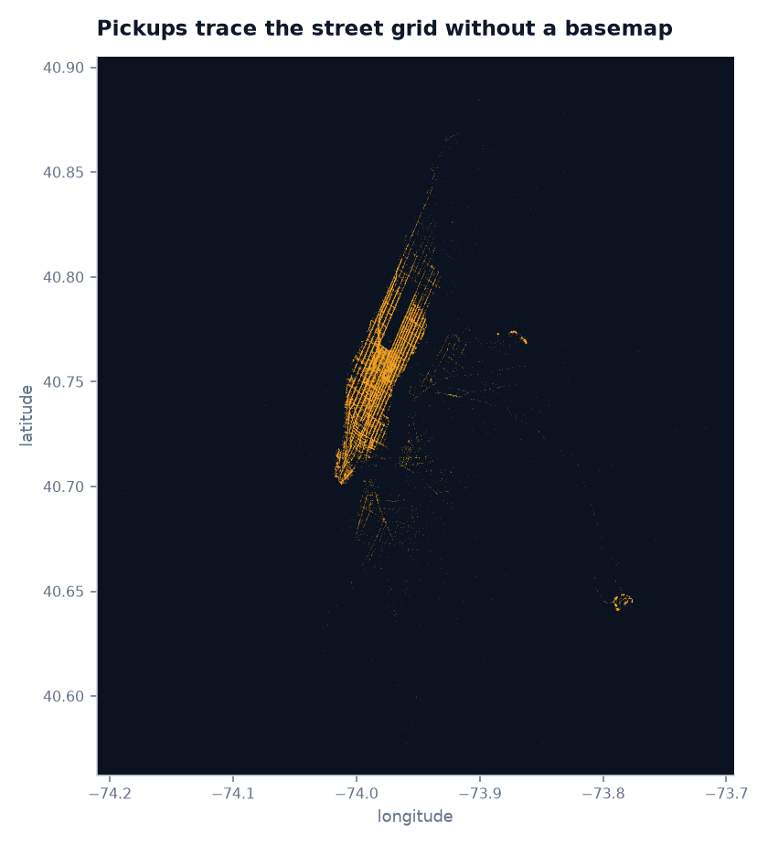
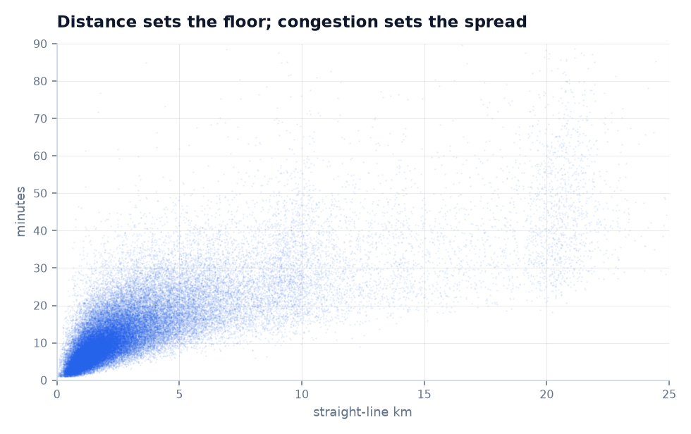

# NYC Taxi Trip Duration — a CRISP-DM walkthrough

A full pass through the six CRISP-DM phases on the Kaggle *New York City Taxi
Trip Duration* problem, ending in a deployed service with an interactive map.
Every number below is produced by the code in this repository; nothing is
quoted from the competition leaderboard or from memory.

---

## Phase 1 — Business understanding

**The question.** A rider standing on a Manhattan sidewalk at 6pm wants to know
one thing: *will I make my flight?* The meter answers that only in retrospect.
The business goal is to answer it before the trip starts.

**Why this is not a solved problem.** Distance alone is a weak predictor in
Manhattan. The same 8 km ride takes 18 minutes at 3am and 42 minutes at 6pm.
Any useful model has to learn the city's congestion clock, not just its
geometry.

**Success criteria.**

| Kind | Criterion | Result |
|---|---|---|
| Business | Beat the obvious "distance ÷ typical speed" rule a dispatcher would use | ✅ 42% lower RMSLE |
| Business | Estimate usually within 5 minutes of truth | ✅ 83.4% of held-out trips |
| Data-science | Minimise RMSLE, the competition metric | ✅ 0.3065 held out |
| Deployment | Predictions fast enough to feel instant in a browser | ✅ 7.5 ms model, ~21 ms end-to-end over HTTP |

**Framing choice.** The model returns an *interval*, not just a point. "About
41 minutes" is less useful to someone catching a flight than "35–52 minutes,"
because the second version communicates its own risk. This shapes Phase 4.

---

## Phase 2 — Data understanding

**Source.** The Kaggle competition ships a 1.46M-row sample of NYC TLC
yellow-taxi records from January–June 2016, with raw pickup and dropoff
coordinates. Two facts about provenance drove the implementation:

* Kaggle requires credentials, so `taxi.ingest` rebuilds an equivalent dataset
  from the primary public source instead.
* The TLC's *current* parquet mirror re-published 2016 with taxi-zone IDs and
  **dropped the coordinates**. That would have sunk a map-driven product, so the
  pipeline pulls from NYC Open Data (`uacg-pexx`), which still serves the
  original coordinate-level records.

Same underlying trips, same columns as the Kaggle CSV, no credentials needed.

**Sampling.** 50,000-row pages are pulled from each of the six months, stratified
by month. Stratification is not cosmetic: an unstratified offset walk over the
API returns overwhelmingly February rows, which would leave the model blind to
the spring ramp in traffic. Result: **1.2M raw rows** spanning 2016-01-01 to
2016-06-30.

**What the data says.**

Duration is sharply right-skewed — a dense mass under 15 minutes with a long
tail of airport runs. The median trip is 11.1 minutes; the 99th percentile is
55 minutes.

Under `log1p`, that skew becomes near-Gaussian. This is the single most
consequential observation in the phase, and it decides the loss function in
Phase 4.

The top panel is demand; the bottom is the finding. Median speed swings from
**29.4 km/h at 5am to 14.0 km/h at midday** — better than a factor of two on
identical geometry. Measured along the grid path, the weekday PM-rush median is
14.7 km/h against 23.2 km/h overnight. This is the signal the model exists to capture.

Weekday commuting peaks and the Friday/Saturday late-night block are visibly
different regimes, which is why weekday-gated rush-hour flags outperform a plain
hour-of-day feature.

Plotting pickups alone redraws the street grid, the bridges and the airports —
with no basemap underneath. Coordinates are informative *by themselves*, which
justifies feeding raw lat/lon to the trees alongside engineered distances.

Distance sets a floor on duration; congestion sets the spread above it. A
distance-only model can only ever predict the bottom edge of this cloud.

**Data-quality issues found.** Coordinates at (0, 0) where GPS never fixed;
zero-second and multi-day durations from meters left running; implied speeds of
several hundred km/h from corrupt coordinate pairs.

---

## Phase 3 — Data preparation

### Cleaning

Each rule is applied in order and its cost recorded, so every dropped row is a
traceable decision rather than a silent filter. The audit is written to
`data/processed/cleaning_audit.json` and rendered live in the dashboard.

| Rule | Rows dropped | Share |
|---|---:|---:|
| Missing timestamp or coordinate | 0 | 0.00% |
| Coordinates outside the NYC bounding box | 19,763 | 1.65% |
| Duration outside [60 s, 3 h] | 8,797 | 0.73% |
| Straight-line distance over 100 km | 0 | 0.00% |
| Implied speed outside [1, 120] km/h | 6,602 | 0.55% |
| **Retained** | **1,164,838** | **97.07%** |

The speed filter earns its place: it catches what the duration and distance
filters individually miss — a 40-minute trip covering 200 m (meter left running
at a curb) and a 3-minute trip covering 30 km (corrupt coordinates) both fail it
while passing every other rule.

### Feature engineering

41 features, all built in `src/taxi/features.py`. Highlights and their
reasoning:

**Grid distance.** A cab cannot fly the great circle; it drives up an avenue and
across a street. Manhattan's grid runs ~29° off true north, so coordinates are
rotated into the grid frame *before* taking the L1 norm. Across the dataset the
grid path runs a median **1.34×** the straight line. (See Phase 5 for what
permutation importance does — and does not — say about this feature.)

**Cyclical time.** Hour-of-day is encoded as `(sin, cos)` of minute-of-day so
23:59 and 00:01 sit adjacent in feature space rather than at opposite ends of a
24-unit line. A test asserts exactly this property.

**Weekday-gated rush flags.** `is_am_rush` and `is_pm_rush` only fire Monday
through Friday. Saturday at 6pm is not rush hour, and an ungated flag teaches
the model that it is.

**Airport proximity.** Distance to JFK, LaGuardia and Newark, plus a binary flag
within 2 km. Airport runs are a different regime: flat fares, highway routing,
terminal queues.

**Learned zones.** MiniBatch KMeans fits 40 spatial clusters on the training
split's pickup *and* dropoff points. `pickup_cluster`, `dropoff_cluster` and
`same_cluster` let the trees express neighbourhood-to-neighbourhood effects
without a 263-way one-hot. The centroids are also drawn on the map, so the
learned geography is inspectable rather than implicit.

**Detour ratio.** `grid_km / haversine_km` — how much further the grid path runs
than the crow flight. High values mean an awkward diagonal.

### Train/serve skew

The training script and the API import **the same `FeatureBuilder`**, and the
fitted KMeans travels inside the model bundle. There is no second
implementation of the feature logic to drift out of sync — the usual way an
accurate notebook becomes an inaccurate service. `test_single_row_matches_the_batch_row`
pins the property directly.

---

## Phase 4 — Modelling

**Target transform.** Trained on `log1p(duration)`. Being 5 minutes off on a
90-minute airport run is a very different error from being 5 minutes off on a
6-minute crosstown hop, and log space prices them accordingly. It also matches
RMSLE, the competition metric, so the loss the model minimises is the loss it is
judged on.

**Splitting.** A **temporal** split: train on 2016-01-01 through 2016-05-25,
test on everything after. A random split leaks — trips from the same rush hour
land on both sides, and the model gets credit for memorising a specific evening.
Training on the past and scoring on the future is what deployment actually looks
like.

**Models.** Three baselines, each a real alternative rather than a strawman:

1. **Global median** — the null model.
2. **Constant speed** — `distance ÷ 12.9 km/h`, the median implied speed. This
   is the rule a dispatcher actually uses, and it is genuinely strong.
3. **Ridge on log duration** — a linear model over distance and time features.

Then **HistGradientBoostingRegressor**: 500 boosting iterations, 63 leaves,
learning rate 0.08, early stopping on a 10% validation slice. Chosen over
XGBoost/LightGBM because it is in scikit-learn — no extra dependency to install,
pin, or explain — and it handles this scale in about a minute on a laptop.

**Prediction interval.** Two additional models fitted with `loss="quantile"` at
q=0.10 and q=0.90. Fitting them in log space keeps the interval
*multiplicative*: roughly ±20% around a 40-minute trip, not a flat ±8 minutes
bolted onto every estimate regardless of length.

---

## Phase 5 — Evaluation

Scored on 232,968 held-out trips from the most recent period.

| Model | RMSLE | MAE | Median abs. err. | R² | Within 5 min |
|---|---:|---:|---:|---:|---:|
| Global median | 0.7427 | 7.9 min | 5.2 min | −0.103 | 47.8% |
| Constant speed (12.9 km/h) | 0.5309 | 6.8 min | 3.4 min | −0.034 | 62.2% |
| Ridge (log space) | 0.5436 | 6.4 min | 3.6 min | −0.177 | 64.4% |
| **Gradient-boosted trees** | **0.3065** | **3.1 min** | **1.9 min** | **0.816** | **83.4%** |

**Reading the table.** The model cuts RMSLE 42% below the strongest baseline and
more than halves its MAE. The negative R² on the baselines is not a bug — it is
the correct signal that predicting the median, or assuming constant speed, is
worse than useless on a target this heteroskedastic.

**Interval calibration.** The p10–p90 band is designed to cover 80% of trips; on
held-out data it covers **77.4%**. Close to nominal and slightly narrow, meaning
the band is mildly optimistic on the hardest trips — worth stating plainly in the
UI rather than hiding, which is what the "Interval calibration" card does.

**What the model leans on.** Permutation importance on held-out trips (not split
counts, which flatter correlated features):

| Feature | Importance |
|---|---:|
| `haversine_km` | 1.431 |
| `bearing` | 0.053 |
| `hour_cos` | 0.046 |
| `minute_of_day` | 0.031 |
| `hour_sin` | 0.026 |
| `dropoff_dist_midtown` | 0.018 |
| `pickup_dist_jfk` | 0.018 |
| `dropoff_dist_jfk` | 0.016 |
| `day_of_week` | 0.015 |

The hierarchy is the expected one — distance sets the floor, time-of-day sets
the multiplier, airports are their own regime — and its absence would have
signalled a leak.

`bearing` ranking second is a genuine finding: direction of travel matters
independently of distance, which is what one would expect on an island where
the bridges and tunnels are the bottleneck.

### An importance result that needed checking

`grid_km` does **not** appear in the top ten, despite being the more physically
faithful distance measure. Read naively, that says the grid rotation was wasted
work. Permuting the two features directly seems to confirm it:

| Permuted | RMSLE | Δ |
|---|---:|---:|
| *(nothing)* | 0.3065 | — |
| `grid_km` | 0.3123 | +0.006 |
| `haversine_km` | 0.9363 | **+0.630** |

That asymmetry is not a statement about the features. It is a statement about
*this fitted model*: the two correlate at **r = 0.9939**, the trees committed to
`haversine_km` during fitting, and permutation never refits, so `grid_km` looks
idle while `haversine_km` looks indispensable.

Refitting is the only test that answers the actual question. `scripts/ablation.py`
drops each feature and retrains from scratch:

| Variant | RMSLE | Δ |
|---|---:|---:|
| All features | 0.3099 | — |
| Drop `grid_km` | 0.3098 | −0.000 |
| Drop `haversine_km` | 0.3105 | +0.001 |
| Drop **both** | 0.3249 | **+0.015** |

(These use a 300-iteration model for speed, so compare them to each other, not
to the 0.3065 headline.)

The conclusion inverts the naive reading: the two distances are **interchangeable
substitutes**. Either alone recovers essentially all the signal; losing both
costs 25× more than losing either. The model needs *a* distance, and it does not
much care which — so the honest report is that the grid rotation is a defensible
modelling choice that this particular target cannot distinguish from haversine,
not that it is dead weight, and not that `haversine_km` is 25× more important
than everything else.

**The general lesson, worth stating because it is easy to get wrong:**
permutation importance on correlated features measures what a model *uses*, not
what it *needs*. Where features are collinear and the answer matters, refit.

**Honest limitations.**

* **No live traffic.** The model knows that 6pm Wednesday is usually slow; it
  cannot know that the Midtown Tunnel is closed tonight. A production version
  would take a real-time congestion feed as a feature.
* **No routing.** Distance is geometric, not driven. The Kaggle leaders' main
  edge came from OSRM route features, which is most of the remaining gap between
  0.305 and their ~0.28.
* **2016 data serving 2026 questions.** Congestion pricing, ride-hailing and the
  pandemic have all reshaped Manhattan traffic since. The pipeline retrains on
  newer data unchanged, but the shipped numbers describe 2016.
* **Sampled, not complete.** 1.2M of ~69M trips in the window. Enough for stable
  estimates; a full pass would need out-of-core training.

---

## Phase 6 — Deployment

**Architecture.** One FastAPI process serves both the JSON API and the
single-page front end. The model bundle — fitted `FeatureBuilder`, point model
and two quantile models — is loaded once at startup and shared across requests.

**Endpoints.**

| Route | Purpose |
|---|---|
| `POST /api/predict` | One trip → duration, interval, ETA, distances, plain-language notes |
| `POST /api/predict/by-hour` | The same trip departing at all 24 hours |
| `GET /api/metrics` | Held-out scores and permutation importances |
| `GET /api/zones` | The 40 learned KMeans centroids |
| `GET /api/stats` | Dataset aggregates for the dashboard |
| `GET /api/health` | Liveness plus model-load status |
| `GET /docs` | Generated OpenAPI documentation |

**Design decisions worth naming.**

*Validation as a product feature.* Coordinates outside the NYC bounding box are
rejected with an explanation ("the model was only ever shown trips inside it")
rather than silently extrapolated. A model asked about San Francisco should
decline, not guess.

*Degrade honestly.* If the bundle is missing, `/api/health` reports `degraded`
and prediction routes return 503 with the command that fixes it. The front end
surfaces that state in the status pill instead of showing stale numbers.

*The sweep endpoint is the actual product.* `POST /api/predict/by-hour` exists
because riders do not want to know how long a trip takes — they want to know
when to leave. Turning a point estimate into a decision is what the deployment
adds on top of the model.

*The map draws what the model knows.* The route line is an L-shaped path bent
along the 29° grid, not a turn-by-turn route. The model predicts duration, not
geometry, so drawing real streets would imply detail the model does not have.
The rendered path is a faithful picture of the `grid_km` feature it actually
consumes.

**Monitoring.** `/api/health` carries the model's training timestamp, and
`/api/metrics` exposes the full held-out report card at runtime — so the
deployed model can always be asked what it scored and when it was fitted.
