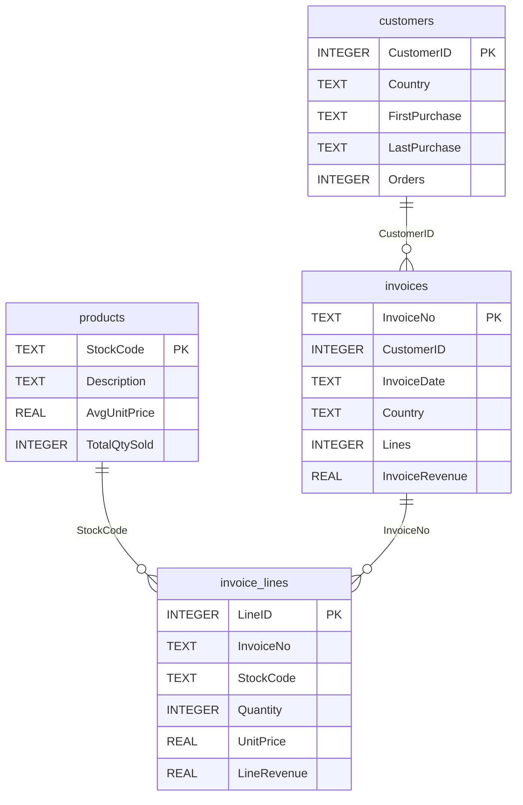

# Warehouse Schema Map - Online Retail

*Produced by the `schema-mapper` skill against `data/processed/retail.db`.*

## Tables

| Table | Grain (one row =) | Rows | PK |
|---|---|---:|---|
| `customers` | one customer | 4,338 | `CustomerID` |
| `invoice_lines` | one product line on one invoice | 397,884 | `LineID` |
| `invoices` | one invoice (order header) | 18,532 | `InvoiceNo` |
| `products` | one stock code | 3,665 | `StockCode` |

## Relationships

## Join paths

- **invoice_lines -> customers** — `invoice_lines JOIN invoices USING (InvoiceNo) JOIN customers USING (CustomerID)   [2 hops]`
- **products -> customers** — `products JOIN invoice_lines USING (StockCode) JOIN invoices USING (InvoiceNo) JOIN customers USING (CustomerID)   [3 hops]`
- **invoices -> products** — `invoices JOIN invoice_lines USING (InvoiceNo) JOIN products USING (StockCode)     [2 hops]`

## Data dictionary

Full per-column dictionary: [`outputs/tables/retail_data_dictionary.csv`](../tables/retail_data_dictionary.csv)

| Table | Column | Type | PK | Null % | Distinct |
|---|---|---|:-:|---:|---:|
| customers | `CustomerID` | INTEGER | Y | 0.0 | 4,338 |
| customers | `Country` | TEXT |  | 0.0 | 37 |
| customers | `FirstPurchase` | TEXT |  | 0.0 | 4,240 |
| customers | `LastPurchase` | TEXT |  | 0.0 | 4,199 |
| customers | `Orders` | INTEGER |  | 0.0 | 59 |
| invoice_lines | `LineID` | INTEGER | Y | 0.0 | 397,884 |
| invoice_lines | `InvoiceNo` | TEXT |  | 0.0 | 18,532 |
| invoice_lines | `StockCode` | TEXT |  | 0.0 | 3,665 |
| invoice_lines | `Quantity` | INTEGER |  | 0.0 | 301 |
| invoice_lines | `UnitPrice` | REAL |  | 0.0 | 440 |
| invoice_lines | `LineRevenue` | REAL |  | 0.0 | 2,939 |
| invoice_lines | `InvoiceDate` | TEXT |  | 0.0 | 17,282 |
| invoices | `InvoiceNo` | TEXT | Y | 0.0 | 18,532 |
| invoices | `CustomerID` | INTEGER |  | 0.0 | 4,338 |
| invoices | `InvoiceDate` | TEXT |  | 0.0 | 17,257 |
| invoices | `Country` | TEXT |  | 0.0 | 37 |
| invoices | `Lines` | INTEGER |  | 0.0 | 199 |
| invoices | `InvoiceRevenue` | REAL |  | 0.0 | 15,268 |
| products | `StockCode` | TEXT | Y | 0.0 | 3,665 |
| products | `Description` | TEXT |  | 0.0 | 3,647 |
| products | `AvgUnitPrice` | REAL |  | 0.0 | 2,640 |
| products | `TotalQtySold` | INTEGER |  | 0.0 | 1,748 |